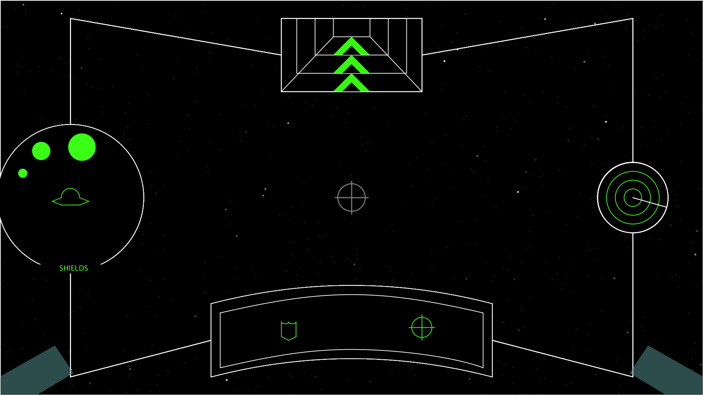
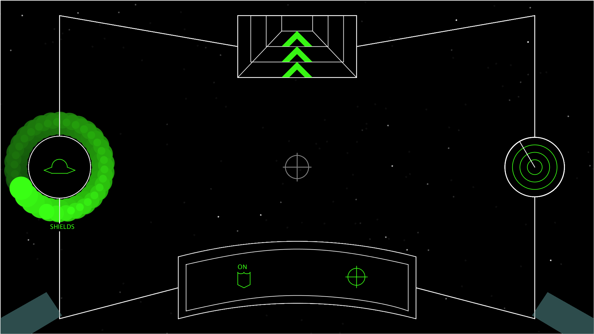

# SciFi UI Project

Name: Dillon Ellis

Student Number: C17322316

# Description of the assignment
This is my assigment for OOP. I decided for this assignment I would make an interface from a space ship, similar to ones you would see if a Sci Fi movie. I included a radar, a shield and two cannons to shoot bullets from.

# Instructions
There are two buttons on the screen. The Shield button is the icon on the control panel shaped like a shield, When you click on this the three circles rotating around the small spaceship on the left of the screen speed up. This makes it look like it is being enclosed by a shield or force field. When it is clicked some text saying 'ON' appears beside the button. Once the button is clicked again the text will disappear and the circles return to the original speed.

The other button is the cross hairs on the control panel, this is used to shoot bullets from the cannons at the bottom corners of the screen. Once you click on this button a burst of bullets shoots from the cannons and stop once they reach the crosshair target at the center of the screen.

# How it works

## Bullet
This is the bullet class. It first translates it's x and y locations to the given co-ordinates in the bottom corners of the screen before drawing the circle for the bullet.

The update function is used to move the bullet across the screen. First, it uses the pVector forward to change the direction of the bullet. The x value is changed using the sine of the angle of rotation and changes the y value using the cosine of the angle of rotation. The bullet is then moved in the direction by using the add fuction to move the pVector pos by the pVector forward and the given speed.

After this I included two if statements. The first statement checks if the direction passed into the bullet is equal to 1. The 1 signifys that the bullet is being shot from the left. If the bullet is going to pass the crosshair target and enter the right side of the screen, the while loop changes the pos back to the corner and sets the speed to zero to stop it.
The second if statement checks if the direction is equal to 2. This shows it is being shot from the right. The while loop stops the bullet from passing the crosshair and entering the left side of the screen.

## Radar
This is the radar class. In render if first draws a background circle and each of the smaller circels contained within it all at the given position. Next it rotates a line around the center using the angle theta, the line is from the pVector pos to the edge of the circle x2, y2 which are updated by adding and subtracting the sine and cosine of the angle.
In update the value of theta is incremented by two pi (the full circle) mulitplied by by a value timeDelta and the given frequency of the rotation. Allowing the line to rotate within the circle like a radar.

## Stars
In this class there is a large rectangle that covers the whole if the screen. I used fill(0,10) on this rectangle, the first value is 0 for the rectangle to be black while its second alpha value is 10 which is the opacity. The I used the random fuction to draw small white ellipses at random points on the screen. The opacity of the large rectangle makes the white ellipses fade out. This makes the ellipses look like stars that are shimmering on the black rectangle.

## Shield Button
The Shield Button class is a small Shield Icon. I used beginShape() and endShape() with vertex's to make the bottom side of the shape with two arcs on top to finish the shape. This co-ordinates of this is then used in UI and mouseClicked() to use the Shield class.

## Shoot Button
The Shoot Button class is a small cross hairs icon. The shape is made using an ellipse with two lines going through it. The co-ordinates of this button is also used in mouseClicked() for activating the Bullet class.

## Shield
The Shield class is a small drawing of a Spaceship with three circles of different sizes spinning around it, when the shoot button is pressed the circles speed up to make the spaceship look like it is surrounded by a shield or force field. In render the spaceship is drawn with an arc on top and some lines beneath it with a background circle behind it. The center is translated to pos and the three circles are drawn at different point around the spaceship and rotated using a given angle.
Underneath this is some text that says shield.
In update angle is changed by adding on 2 times degree, this sets the speed at which the three circles rotate around the spaceship.
ShieldOn() is for when the user click on the Shield button, in this the speed is increased to angle plus 10 times degree, rather than the original 2 times.
This speed along with the opacity from the rectangle in Stars makes it look like the spaceship is fully surrounded. Some text also appears on the screen beside the shield button saying "ON".

## Screen Outline
This contains all of the lines around the screen including the crosshairs at the center of the screen, control panel and cannons.
Most of this was done using basic lines, ellipses and rectangles. The arrows at he top were made by putting a smaller black triangle within the big triangle to make it look like an arrow.
The control panel was used using custom shapes with beginShape() and endShape(). The curves were made in this with curvedVertex(), to do with five points were need in each curve. The second point is the start of the curve the third point is the peak of the curve and the fourth point is the end of the curve. The first and fifth point are control points there are used to decide what direction the curve will enter and exit at, this can change the shape of the curve a lot.

## UIObject
This is an abstract class containing pos, ui, height and width. These fields are used regularly in a number of class' so I made them into an abstract class that can then be extended by the class.

## UI
The UI class contains the setting, setup, mouseClicked and draw.
In settings all I have is fullScreen(), In setup all of the parameters are passed to each class. Bullet is there twice as it is needed for both bottom corners of the screen.
In mouseClicked I used nested if statements to check the x and y boundaries of the area where each button will be. The first is for the shoot button, if the mouses' x and y values are within the boundaries when it is clicked then fire is set to 1.
In draw there is then an if statement that checks whether fire is equal to 1. Therefore once the button is clicked and fire is set to 1 then the render and update is called and a bullet is fired.
The next is for the shields, the if statements check if the mouse is clicked within the boundaries and if it is it increments the value restore which starts at 1. Then in draw there is an if statement that checks if restore mod 2 is equal to 0, if it is the shieldOn() is called. If the button is clicked again it will not be equal to 0 and the shield will turn off. This makes this button act as a switch that can be turned on and off.
In draw the rest of the renders and updates are not in statements or loops and run as normal.

## Main
Main is used to runSketch in the UI and then run the program.

# What I am most proud of in the assignment
What I am most pround about in this assignment is the Shield and it's button and use of shieldOn() as a switch.
The reason I am most proud of this part is that it was the most creative part of the assignment and how much the idea progressed. I originally  only had the circles to spin without the fading part behind it and it didnt look as good, so I increased the speed when the button is pressed and also made the black background of the circle smaller so that the three circles would be affected by the opacity of the rectangles in the background. I thought this feature looked a lot better as it actually looks like a shield.
The second part of this was making the button a switch. Originally once the button was pressed the speed increased and would stay that way. Then I realised I could use '%' to check if the value was odd or even and this made it into a switch.

The shield before: 



The shield after:




## YouTube Video

This is a youtube video of my assigment:

[](https://youtu.be/jbOD09Q_CYc)


# Markdown Tutorial

This is *emphasis*

This is a bulleted list

- Item
- Item

This is a numbered list

1. Item
1. Item

This is a [hyperlink](http://bryanduggan.org)

# Headings
## Headings
#### Headings
##### Headings

This is code:

```Java
public void render()
{
	ui.noFill();
	ui.stroke(255);
	ui.rect(x, y, width, height);
	ui.textAlign(PApplet.CENTER, PApplet.CENTER);
	ui.text(text, x + width * 0.5f, y + height * 0.5f);
}
```

So is this without specifying the language:

```
public void render()
{
	ui.noFill();
	ui.stroke(255);
	ui.rect(x, y, width, height);
	ui.textAlign(PApplet.CENTER, PApplet.CENTER);
	ui.text(text, x + width * 0.5f, y + height * 0.5f);
}
```

This is an image using a relative URL:


This is an image using an absolute URL:


This is a youtube video:

[](https://www.youtube.com/watch?v=J2kHSSFA4NU)

This is a table:

| Heading 1 | Heading 2 |
|-----------|-----------|
|Some stuff | Some more stuff in this column |
|Some stuff | Some more stuff in this column |
|Some stuff | Some more stuff in this column |
|Some stuff | Some more stuff in this column |

